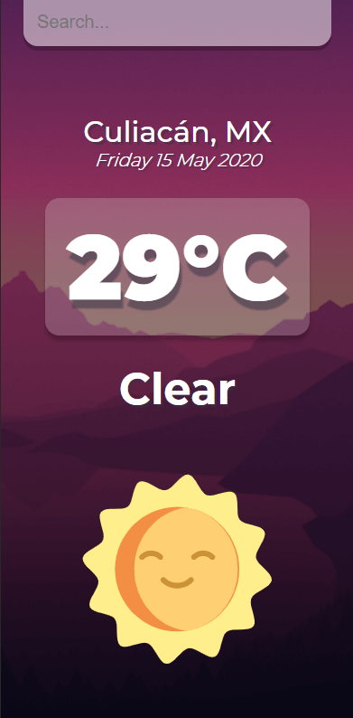
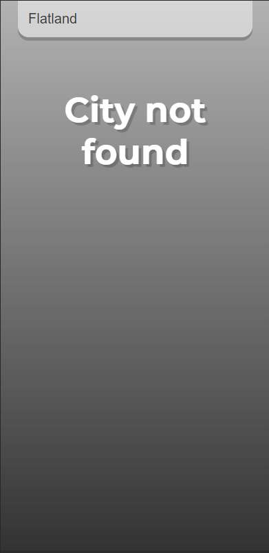
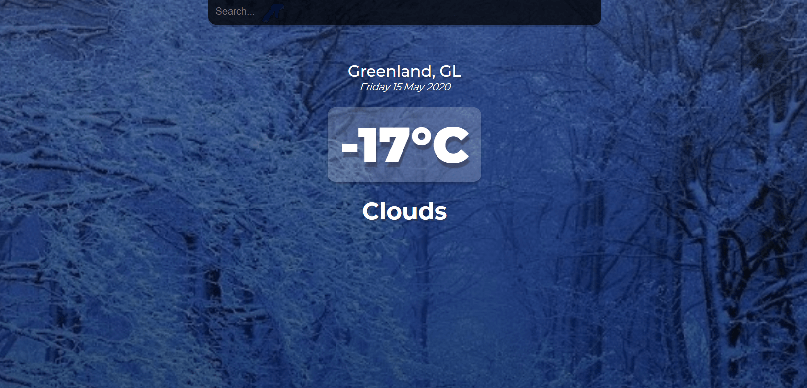
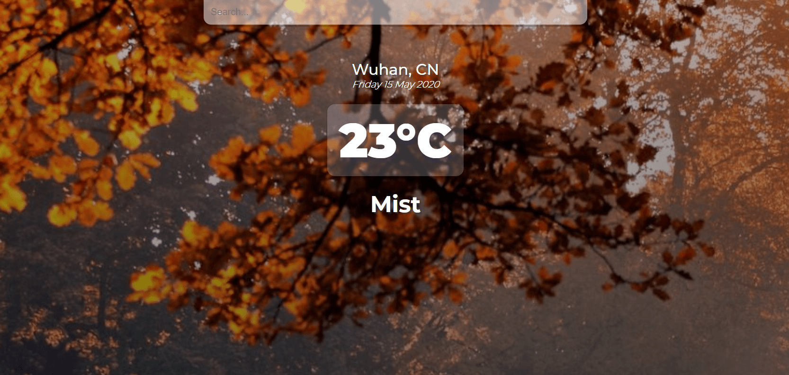

This project was bootstrapped with [Create React App](https://github.com/facebook/create-react-app).

## Hi! This is my Weather App created with React.js

### It have some JSON animations :)

#### They appear **only** in mobile devices

 

#### When you use the desktop version the background images change

 

### You can try this web [here](https://urielexis64.github.io/modern-weather-app/)
